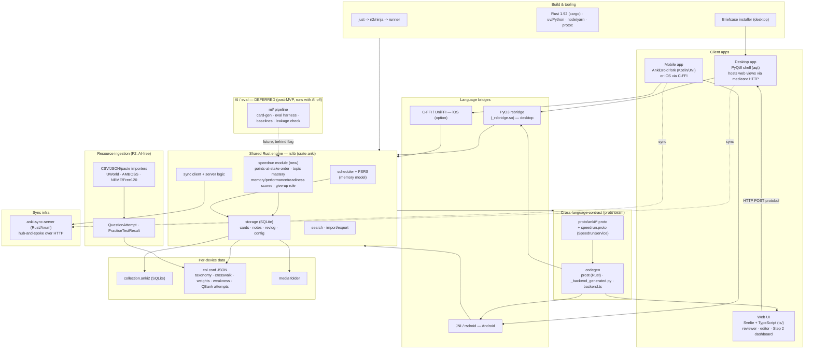

# Speedrun Tech Stack

The full technology stack for Speedrun (the Step 2 CK study app built on the Anki fork). Linked from
the Tech Stack section of `docs/PRD.md`. It keeps Anki's layered architecture — clients talk to one
shared Rust engine across a single **protobuf contract** — and adds a Rust `speedrun` engine module, a
phone client on the *same* engine, a Step 2 dashboard, resource ingestion, and a deferred AI/eval
lane. The product runs fully with **AI off**.

See `docs/codebase_notes.md` for where each piece lives in the source tree, and
`docs/factory_workflow.md` for how the lanes map onto this stack.

## Layer notes

- **One engine, many clients.** Desktop (PyO3) and mobile (JNI / C-FFI) both call the *same* `rslib`
  via `run_service_method(service, method, protobuf_bytes)`. The mandatory Rust change (points-at-stake
  queue) therefore ships to both platforms automatically.
- **Contract-first.** `proto/anki/*.proto` plus our additive `speedrun.proto` are the only
  cross-layer API; codegen produces Rust traits, Python `_backend_generated.py`, and TS `backend.ts`.
  Our additions are isolated in `speedrun.proto` to keep upstream merges cheap.
- **No schema migration for the MVP.** Topic taxonomy, card→topic crosswalk, blueprint weights,
  per-topic weakness, and imported QBank attempts are stored as JSON in `col.conf` (sync- and
  undo-safe). A dedicated table can replace this post-MVP.
- **Sync is hub-and-spoke**, not peer-to-peer: each device merges with `anki-sync-server`; the
  conflict rule is last-write-wins by modification time (see `docs/codebase_notes.md` §6).
- **AI is deferred.** The `ml/` lane (card generation, eval, baselines, leakage check) attaches behind
  a feature flag after the MVP; the core scores and queue run with AI switched off.
