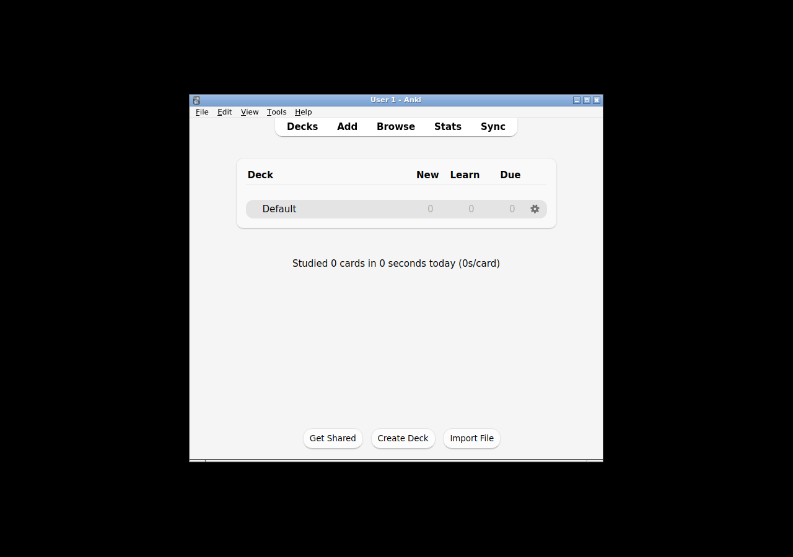

# W1 — Linux installer that runs on a clean machine (Wednesday DoD)

Speedrun ships an **installable Linux desktop app that runs with AI off** (AI is out of
scope for the MVP). Anki's `qt/tools/build_installer.py` only builds for the *host* OS, so a
Linux installer must be built **on Linux**. This directory builds it inside a Linux container
and then verifies it on a **separate, clean** Linux container that has only runtime libraries
(no build toolchain) — proving it works like an end-user install.

- **Host:** macOS (Apple Silicon). Docker is provided by **colima** (a Linux VM); there is no
  Docker Desktop. `colima start` boots an Ubuntu 24.04 `aarch64` VM.
- **Arch:** everything here is `linux/arm64` (aarch64) — the colima VM, the build, and the
  clean box all match. On an x86_64 host the same files produce an `x86_64` installer. Building
  the *other* arch would require slow QEMU emulation and is intentionally not done.
- **Artifact:** `anki/out/installer/dist/anki-<ver>-linux-<arch>.tar.zst` (git-ignored, stays
  in `out/`). This build produced `anki-26.5-linux-aarch64.tar.zst` (~182 MiB).

## Files

| File | Purpose |
|------|---------|
| `Dockerfile.build` | Full Anki Linux build toolchain (mirrors `.github/actions/setup-anki` + the release workflow's fcitx deps; rustup + `n2`). |
| `Dockerfile.clean` | Fresh box with **only** Anki runtime libs + a headless X harness (`xvfb`, `openbox`, `xdotool`, screenshot tools). No rust/cargo/n2/uv/gcc. |
| `build_and_verify.sh` | Host orchestrator: `images` \| `build` \| `verify` \| `all`. Handles mounts, caches, and logging. |
| `scripts/in_container_build.sh` | Runs in the build image: `./ninja wheels` → `build_installer.py build` → `package`. |
| `scripts/in_container_smoke.sh` | Runs in the clean image: extracts the artifact and runs the layered smoke test. |
| `logs/` | Captured proof (see **Results**). |

## Reproduce

Prereqs (already done on this host): `brew install colima docker && colima start --cpu 10 --memory 16 --disk 100`.

```bash
# From the repo root of this worktree:
proof/wednesday/linux/build_and_verify.sh all      # images + build + verify
# or step by step:
proof/wednesday/linux/build_and_verify.sh images   # build both docker images
proof/wednesday/linux/build_and_verify.sh build    # build the Linux installer (compiles the Rust core; slow first run)
proof/wednesday/linux/build_and_verify.sh verify   # clean-machine smoke test
```

`RELEASE=2 proof/wednesday/linux/build_and_verify.sh build` produces the optimized/production
installer (slower). The default (unset `RELEASE`) is a debug build — much faster and fully
functional, which is what the smoke test below exercises.

Under the hood the build runs exactly what CI's `build-linux-arm-installer` job runs, minus the
`./ninja installer` wrapper (which also syncs the Windows/macOS template submodules, irrelevant
on Linux). The wheel + installer commands are identical to those in
[`../INSTALLER.md`](../INSTALLER.md) (the macOS proof):

```bash
./ninja pylib qt wheels
out/pyenv/bin/python qt/tools/build_installer.py --version 26.5 build \
  --aqt_wheel out/wheels/aqt-26.5-py3-none-any.whl \
  --anki_wheel out/wheels/anki-26.5-cp310-abi3-manylinux_2_35_aarch64.whl
out/pyenv/bin/python qt/tools/build_installer.py --version 26.5 package
```

## Results (this build)

- **`docker version`** — client `darwin/arm64` (colima context) → server `linux/arm64`,
  Docker Engine 29.x, Ubuntu 24.04 VM. Full output: [`logs/docker-version.log`](logs/docker-version.log).
- **Installer build** — success; full log [`logs/build.log`](logs/build.log):
  - `out/wheels/anki-26.5-cp310-abi3-manylinux_2_35_aarch64.whl`, `out/wheels/aqt-26.5-py3-none-any.whl`
  - **`out/installer/dist/anki-26.5-linux-aarch64.tar.zst`** (190,937,014 bytes,
    sha256 `2d9a5247dffecc577c41cda44a67569a5858b1c01f5ef1771fa9393ae0a4cfa7`)
  - The bundle extracts to `anki-linux/` (bootstrap `anki` launcher + embedded CPython 3.13 +
    `app`/`app_packages` + `install.sh`), ~673 MiB uncompressed.
- **Clean-machine smoke** — `PASS`; full log [`logs/clean-smoke.log`](logs/clean-smoke.log),
  app log [`logs/linux-clean-anki_gui.log`](logs/linux-clean-anki_gui.log):
  1. `anki --version` → `Anki 26.05`, exit 0 (bundle + Qt/WebEngine libs load).
  2. **Engine (AI off):** the bundled interpreter + compiled `_rsbridge` Rust engine create a
     collection, add a note (`note_count: 1  card_count: 1`), and touch the scheduler — exit 0.
  3. **GUI (AI off):** launched under `xvfb`; the main window **`User 1 - Anki`** opens,
     `aqt.mediasrv` serves the web UI, `User 1/collection.anki2` (+ `collection.media`,
     `backups`) is created, and the app **exits cleanly (exit 0)** via Ctrl+Q.



The screenshot is the real Anki deck browser rendered on the clean box (Decks/Add/Browse/Stats/
Sync, the Default deck, "Studied 0 cards…"). `--safemode` (no add-ons, no auto-sync) keeps the
run AI-off and deterministic. `install.sh` in the bundle is the alternative system-wide install
path (it `apt-get`s the same runtime libs and installs to `/usr/local`); the smoke runs the
bundle in place instead so the clean-box lib set is explicit in `Dockerfile.clean`.

## Infra notes / decisions (non-obvious things that had to be solved)

1. **`RELEASE` must be *unset*, not empty.** The esbuild TS bundlers use `minify: env.RELEASE && true`;
   an empty-string `RELEASE` becomes `""` (not a boolean) and esbuild rejects it. The orchestrator
   only forwards `RELEASE` when non-empty, and the build script `unset`s an empty value.
2. **Briefcase support-package extraction vs. virtiofs.** The python-build-standalone support
   package contains a large tree of relative symlinks (`python/share/terminfo/*`). Python 3.13's
   `tarfile` data-filter runs `os.path.realpath()` on every member, which raises `ELOOP` on the
   colima virtiofs bind-mount. Fix: the build redirects `out/installer` onto a real
   container-local fs for the Briefcase step, then copies the finished `.tar.zst` back onto the
   mount (`in_container_build.sh`). The Rust build itself is fine on the mount.
3. **Clean-box runtime libs.** `ldd` on the bundled Qt libs showed only two missing sonames on a
   bare Ubuntu 24.04: `libsnappy.so.1` and `libminizip.so.1` (QtWebEngineCore/Process). Added
   `libsnappy1v5 libminizip1` to `Dockerfile.clean`. The xcb platform plugin and `_rsbridge`
   had all deps satisfied out of the box.
4. **First-run Language chooser.** Anki always shows a one-time language dialog on a fresh base
   dir (the `-l` flag only sets the session language). Rather than drive a modal dialog under a
   headless X server, the smoke pre-seeds `defaultLang` into `prefs21.db` via the **bundled**
   `aqt.profiles.ProfileManager` (a normal one-time config step, no display needed); Anki then
   boots straight to the deck screen. A window-manager (`openbox`) + `xdotool` Ctrl+Q are used
   for a clean quit.

## Status / honesty

- **Fully working:** Linux installer builds in-container; artifact produced; verified on a
  clean, toolchain-free container — `anki --version`, an engine collection-create (AI off), and
  a full GUI launch→collection→clean-exit all pass under `xvfb`.
- **Scope:** debug build by default (functional; use `RELEASE=2` for the production installer).
  `aarch64` only on this host (matches the colima VM); `x86_64` is the same recipe on an x86 host.
- **Harmless clean-box warnings** (see the app log): no D-Bus/Vulkan in the container (software
  GL fallback), `mpv not found` (audio; falls back to mplayer) — none affect startup.
